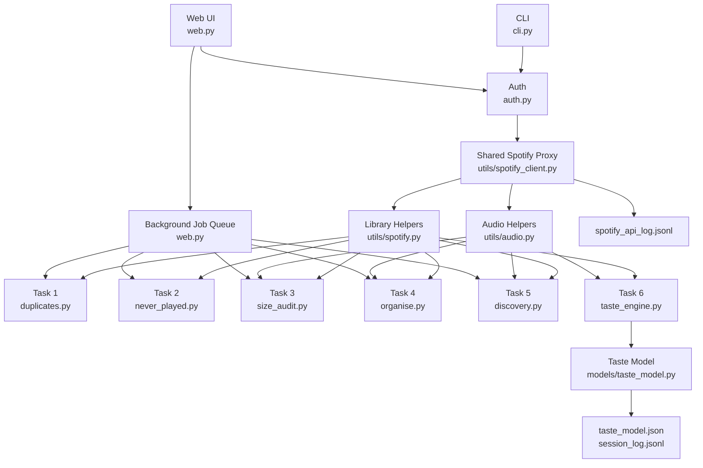
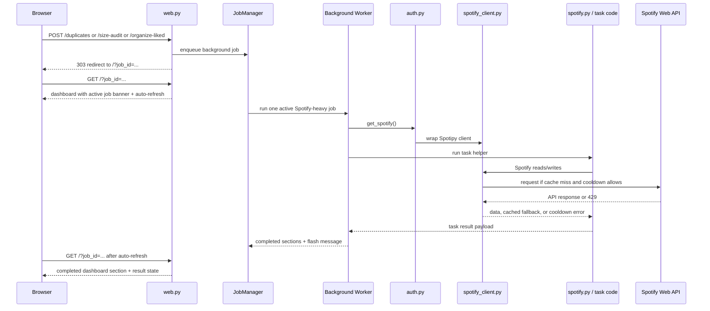

# Architecture Reference

This document is the current map of `spotify_manager` after the web UI, shared Spotify client, background-job queue, and snapshot-aware caching work.

## High-Level Shape

- `spotify_manager/cli.py`
  Runs Tasks 1–6 in the terminal and tags each task with a Spotify request context for logging.
- `spotify_manager/web.py`
  Serves the local browser UI, serializes Spotify-heavy jobs through one background worker, and renders job status plus task results.
- `spotify_manager/auth.py`
  Builds the authenticated Spotipy client and wraps it in the shared Spotify controller.
- `spotify_manager/utils/spotify_client.py`
  Central place for request spacing, cooldown handling, result caching, and request logging.
- `spotify_manager/utils/spotify.py`
  Higher-level Spotify library helpers, including normalized playlist-track fetches, liked-song fetches, and snapshot-aware playlist caching.
- `spotify_manager/tasks/*.py`
  Task-specific business logic for duplicates, never-played review, size audit, liked-song organization, discovery, and the taste engine.
- `spotify_manager/models/taste_model.py`
  Persistent taste-engine model state and session history.

## Repository Diagram

## Web Request Pipeline

## Spotify Control Plane

The shared Spotify proxy is the control plane for API safety:

- It spaces requests slightly to avoid bursty back-to-back traffic.
- It caches stable reads with endpoint-specific TTLs.
- It tracks Spotify cooldown windows from `429` responses.
- It serves stale cached data during cooldown when that is safe.
- It logs task-tagged request events to `spotify_api_log.jsonl`.
- It invalidates low-level caches after writes.

The higher-level library helpers build on top of that with:

- normalized playlist-track caching
- normalized liked-song caching
- playlist `snapshot_id` reuse so unchanged playlists skip full re-normalization

## Data Flow by Task

- Task 1
  Source playlist or liked songs -> normalized track list -> semantic duplicate matcher -> removal payload -> Spotify write
- Task 2
  Recent plays + selected playlist tracks -> stale-track filter -> JSON report / web table
- Task 3
  Playlist metadata -> size threshold check -> optional audio-feature clustering preview
- Task 4
  Liked songs -> audio features and artist genres -> grouped result -> optional playlist creation
- Task 5
  Song seed and/or playlist profile -> recommendation request -> audio-feature scoring -> optional playlist save
- Task 6
  Full library index -> taste model build -> recommendation strategy -> ratings -> persistent model/session update

## Cache Layers

There are two main cache layers:

1. Proxy response cache in `utils/spotify_client.py`
   Covers raw Spotify method results like playlist pages, liked-song pages, audio features, artists, recommendations, and recent activity.

2. Normalized library cache in `utils/spotify.py`
   Covers processed playlist tracks and liked songs that task code consumes directly.

This split matters:

- The proxy cache reduces repeated API traffic.
- The normalized cache reduces repeated Python-side processing on unchanged data.

## Logging and Diagnostics

Use `spotify_api_log.jsonl` when we need to understand rate-limit behavior. Each line records:

- timestamp
- task context
- endpoint or method
- duration
- cache outcome
- success/error/cooldown-block status

Useful patterns to check:

- repeated `miss` results for the same endpoint within a short window
- `cooldown_block` events after a specific task
- endpoints that dominate request count during Task 4 or Task 6

## Design Notes for Future Work

- If we add more web features, default to the existing background-job queue for Spotify-heavy actions rather than direct synchronous POST handlers.
- If we add new Spotify reads, choose a cache policy in `utils/spotify_client.py` before calling the endpoint from task code.
- If we add new playlist mutations, invalidate both low-level proxy caches and normalized playlist caches.
- If we add richer UI status, keep the job queue authoritative for state rather than duplicating progress state in the browser.
